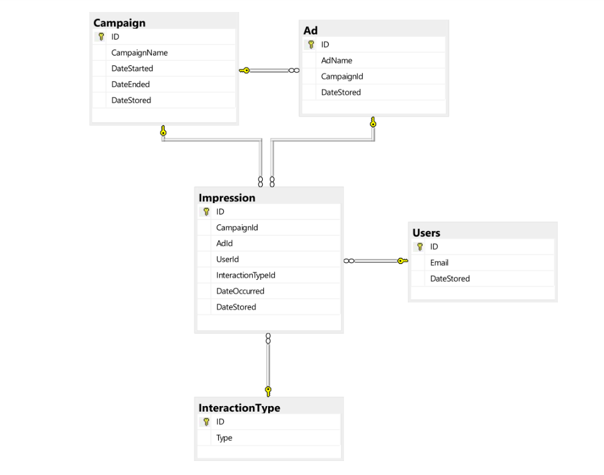

# CELTRA DATA ENGINEER CHALLENGE
##### author: Marko Prelevikj, 09.2018

Table of contents:
1. [Introduction](#intro)
2. [Database](#db)
3. [Data Generator](#generator)
4. [Reporting tool](#tool)
5. [Build](#build)
6. [Deployment](#deploy)
7. [Live demo](#demo)

<a name="intro"></a>
### Introduction

This is a sample application, following the guidelines provided in [this](https://gist.github.com/gregakespret/943414b3bf457bb9fc1d82d81bc3fbeb) gist.

It is implemented in JavaEE, with the usage of [KumuluzEE](https://ee.kumuluz.com/) framework. 
It is a framework for rapid development of microservice-based, cloud-native applications. 
It's got a variety of extensions, some of the used in this implementation are: 
Open-API (Swagger) - API visualization dashboard, Health checks, Metrics of API usage, and Hibernate as the object-relational modeler for the database.

Main application components:

1. SQL Server database
2. Data generator
3. Reporting tool

<a name="db"></a>
### Database:

The database is structured as shown below:



It is consisted of 5 different database tables: `Campaign`, `Ad`, `Users`, `Impression`, and `InteractionType`. 

Given the description in the provided guideline, the database relies upon the data given in the `Impression` table the most. It is due to the data stored within, which is connecting the users with the ads and campaigns.

This gives us the idea that we are actually dealing with a small data-mart, which contains only limited amount of data, but is a part of a bigger data-warehouse.
Nevertheless, it contains rather a lot of useful information regarding the ads and the campaigns.

<a name="generator"></a>
### Data generator

The generator populates the database with some fake, yet reliable data. It has multiple parameters:

- `intervalFrom` - denotes from when to generate new objects (default one week prior to `now`)
- `intervalTo` - denotes until when to generate new objects (default `now`)
- `numberOfCampaigns` - how many new campaigns to generate (default `10`)
- `numberOfAds` - how many new ads to generate (default `10`)
- `numberOfImpressions` - how many new impressions to generate (default `10`)
- `numberOfUsers` - how many users to be used (default `10`)

At first, it checks whether it has a sufficient amount of users in the database, if not, it creates additional in order 
to meet the demand. Afterwards, it generates the new campaign objects which can be finished (with probability `0.3`), 
ongoing (also with probability `0.3`), or none of these (i.e. `dateStarted` and `dateEnded` are not set, with probability `0.4`).
Then, the new ads, which are allocated to a campaign uniformly at random.

The generation of new impressions is somewhat more complicated, as it needs to be determined when it has occured (only in 
the timeframe defined in the campaign, or the global interval from-to), then the generator needs to determine which user 
to assign the impression to, whilst it takes care that there are no more than 10 impressions per user. Finally, an interaction is 
chosen uniformly at random between `swipe`, `touch`, `pinch`, `click`, only if there is a decision to make an interaction, 
which has a probability of `0.15`.

<a name="tool"></a>
### Reporting tool

The reporting tool is consisted of a set of API endpoints for obtaining the data via:

- **ID** - filter the ad/campaign by its ID, or a list of IDs
- **name** - filter the ad/campaign by its name, or a list of names
- **time-frame** - define a from/to time-frame which can obtain the data aggregated on a day level,
or it can aggregate it for the entire ad/campaign lifespan   

These resources are available for both ads and campaigns, 
whereas the following are exclusive for campaigns:

- **status** - filter the campaigns based on their status: ongoing or finished, 
and obtain their statistics
- **detailed** - obtain statistics for a particular campaign via ID, 
and retrieve detailed information for each ad which is assigned to the campaign.

The underlying statistics which are available in the summary objects are the following:

- `impressions` - number of total impressions made to the users
- `uniqueUsers` - number of all unique users that engaged the ad/campaign
- `interactions` - number of all interactions
- `swipe` - number of swipes per ad/campaign
- `touch` - number of touches per ad/campaign
- `pinch` - number of pinches per ad/campaign
- `click` - number of clicks per ad/campaign

<a name="build"></a>
### Build

As a build tool, I have chosen Maven. There are 2 (two) different build profiles:

1. `dev` - uses a local instance of an SQL server. Thus it requires some additional configuration to run it locally.*
2. `prod` - uses an online instance of an SQL server (hosted on a virtual machine on GCP)

To build the project locally, run:

```
mvn clean package -P (dev|prod)
```

or let your IDE take care of it, once you have imported the Maven project :)

Once you have done that, you have 2 options:

1. run the built jar with:

```
cd rest/ && java -jar target/rest-1.0-SNAPSHOT.jar
```

2. wrap it in a docker container and run it:

```
cd rest/

docker build -t celtra-data-challenge .

docker run -p <local_port>:80 celtra-data-challenge
```


(*) in the configuration file, located in 

```
celtra-data-challange/rest/src/main/resources/dev/config.yaml
```

update the credentials for the data source. You can also manage the application port (default to `80`),
and the log level (default to `INFO`) from the config file.

<a name="deploy"></a>
### Deployment

The deployment is done on Google Cloud Platform, i.e. on the Kubernetes Engine. The built Docker image is hosted on Google Container Registry.

Kubernetes allows to easiliy scale the application horizontally, and it is the easiest, and most reliable option (according to me) for automatic horizontal scaling. In case of a pod failure, Kubernetes will replace the failed pod immediatelly after detection, which is usually within seconds.

The settings for automatic scaling are simple, just the CPU of a pod has to be greater than 60%. 
If this is met, then it there will be deployed a new pod with the same docker image. 
The maximum number of pods is set to 5, and there are at least 2 pods running at all times.

<a name="demo"></a>
### Demo

The live demo is accessible at this [link](http://35.202.168.112/api-specs/ui).
Where the landing page is a Swagger API explorer, which contains the documentation for each API end-point.

The APIs required in the objective of the assignment are:

```
# gets the summary of a campaign, and its ads:
curl -X GET "http://35.202.168.112:80/v1/report/campaign/8/ads" -H  "accept: application/json"

# gets the summary of all ads from the previous week:
curl -X GET "http://35.202.168.112:80/v1/report/ad/date" -H  "accept: application/json"
```
